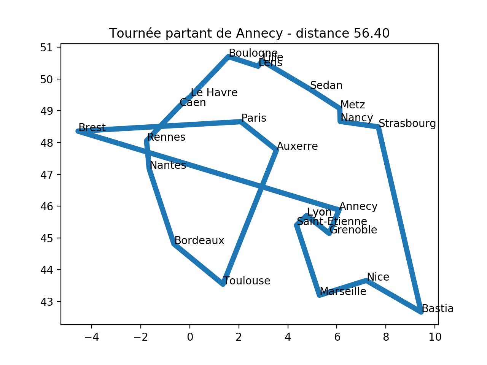

# [TSP - Le voyageur de commerce](https://github.com/qkzk/data_colab/tree/master/TSP)

**[Consignes précises disponibles à la fin du TP](https://github.com/qkzk/data_colab/tree/master/TSP#consignes-pr%C3%A9cises)**

Le problème du voyageur de commerce - _Traveling Salesman Problem_
TSP -, étudié depuis le 19e siècle, est l’un des plus connus dans le domaine de la recherche opérationnelle. William Rowan Hamilton a posé pour la première fois ce problème sous forme de jeu dès 1859.

## Problème

Le problème du TSP sous sa forme la plus classique est le suivant : « Un voyageur de commerce doit visiter une et une seule fois un nombre fini de villes et revenir à son point d’origine. Trouvez l’ordre de visite des villes qui minimise la distance totale parcourue par le voyageur ». Ce problème d’optimisation combinatoire appartient à la classe des problèmes NP-Complets.

Les domaines d’application sont nombreux : problèmes de logistique, de transport aussi bien de marchandises que de personnes, et plus largement toutes sortes de problèmes d’ordonnancement. Certains problèmes rencontrés dans l’industrie se modélisent sous la forme d’un problème de voyageur de commerce, comme l’optimisation de trajectoires de machines outils : comment percer plusieurs points sur une carte électronique le plus vite possible ?

Pour un ensemble de \$`n`\$ points, il existe au total \$`n!`\$ chemins
possibles. Le point de départ ne changeant pas la longueur du chemin,
on peut choisir celui-ci de façon arbitraire, on a ainsi \$`(n-1)!`\$
chemins différents. Enfin, chaque chemin pouvant être parcouru dans
deux sens et les deux possibilités ayant la même longueur, on peut
diviser ce nombre par deux. Par exemple, si on nomme les points, \$`a,
b, c, d`\$, les chemins \$`abcd, bcda, cdab, dabc, adcb, dcba, cbad,
badc`\$ ont tous la même longueur, seul le point de départ et le sens
de parcours change. On a donc \$`\frac{1}{2}(n-1)`\$ chemins candidats
à considérer. \
Par exemple, pour \$`71`\$ villes, le nombre de chemins candidats est
supérieur à \$`5 × 10^{80}`\$ qui est environ le nombre d'atomes dans l'univers
connu. \
([Page wikipedia _Problème du voyageur de commerce_](https://fr.wikipedia.org/wiki/Problème_du_voyageur_de_commerce)).


## Heuristique gloutone

L'objectif de ce TP est de réaliser un algorithme glouton pour résoudre le TSP.

Pour cela vous avez à votre disposition :

- un jeu de données [exemple.txt](exemple.txt)  contenant les
  coordonnées de différentes villes à raison d'une par ligne sous la
  forme `nom_de_la_ville latitude longitude`, vous pouvez bien sur
  l'étendre ou en générer un nouveau avec vos propres villes.

  Par exemple

  ```
    Annecy	6,082499981	45,8782196
    Auxerre	3,537309885	 47,76720047
    Bastia	9,434300423	42,66175842
  ```

- Un fichier [TSP_biblio.py](TSP_biblio.py) contenant un ensemble de fonctions permettant la lecture des données et la visualisation d'un tour réalisé par le voyageur (ici pour le moment dans l'ordre d'apparition). Voici les principales fonctions

    ```python
    def get_tour_fichier(f):
        """
        Lit le fichier de villes format ville, latitude, longitude
        Renvoie un tour contenant les villes dans l ordre du fichier
        : param f: nom de fichier
        : return : (list)
        """
    ```

    ```python
    def distance (tour, i, j) :
        """
        Distance euclidienne entre deux villes i et j
        : param tour: sequence de ville
        : param i: numero de la ville de départ
        : param j: numero de la ville d arrivee
        : return: float
        CU: i et j dans le tour
        """
    ```

    ```python
    def longueur_tour (tour) :
        """
        Longueur totale d une tournée de la ville de départ et retourne à la ville de départ
        : param tour: tournee de ville n villes = n segments
        : return: float distance totale
        """
    ```

    ```python
    def trace (tour) :
        """
        Trace la tournée realisée
        : param tour: liste de ville
        """
    ```




Afin de créer l'algorithme glouton pour résoudre le problème du TSP, nous allons réaliser certaines étapes.

1. Définir l'heuristique de choix de la solution optimale locale
2. Réaliser un programme Python utilisant les fonctions définies pour la lecture et l'affichage permettant de mettre en œuvre l'heuristique. Pour cela vous pouvez :
   1. réaliser une fonction qui génère une matrice qui stocke les distances 2 à 2 entre toutes les villes afin de ne faire le calcul de distance qu'une seule fois.
   2. réaliser une fonction qui retourne l'indice de la ville la plus proche étant donnée une ville, une liste de ville sous forme d'indice, une matrice de distance.
   3. réaliser l'heuristique gloutonne donnant le tour parcouru par le voyageur de commerce à partir d'une ville donnée en paramètre, la liste des villes et la matrice de distance ville à ville (on passera par un système d'indice).

---

## Consignes précises

L'objectif du TP est de programmer en Python plusieurs fonctions qui résolvent le problème du voyageur de commerce.

* Vous disposez de plusieurs fonctions qui vous seront utiles dans le fichier `TSP_biblio.py`. Télechargez le.
* La liste des ville de la tournée est disponible dans le fichier `exemple.py`. Télechargez le.
* Créez un fichier `tsp.py` dans votre dossier. Vous travaillerez localement avec Thonny.
* **Vous rendrez votre travail via "rendre le devoir" de Classroom, comme d'habitude.**

    **Tout ce que vous avez à rendre est votre fichier `tsp.py`**

Lors de l'exécution de votre fichier, deux résultats sont attendus :

1. l'affichage dans la console du parcours réalisé par le voyageur de commerce.
2. l'affichage graphique du parcours (similaire à celui présenté plus haut) de votre parcours.

## Étapes et conseils

Vous pouvez résoudre le problème en seulement 4 fonctions et 30 lignes de code.
Ce n'est donc pas un TP difficile.

1. Commencez par générer la matrice des distances entre les villes. Une ligne par ville, une colonne par ville, chaque cellule est la distance qui les sépare.
2. Quelle heuristique allez-vous choisir ?

    _**Heuristique** : Méthode de calcul qui fournit rapidement une solution réalisable, pas nécessairement optimale ou exacte, pour un problème d'optimisation difficile._
3. Ensuite créez une fonction qui vérifie la signature suivante :

    ~~~python
    def indice_distance_min(ville, liste_ville, distances):
        '''
        Retourne l'indice de la ville la plus proche étant
        donnée une ville, une liste de ville sous forme d'indice, une matrice de
        distance.

        :param ville: (int) indice d'une ville
        :param liste_ville: (list) liste d'indice des ville
        :param (distance):  (list of list of float) matrice des distances
        :return: (int) l'indice de la ville la plus proche parmi ceux de la liste
        '''
        pass
    ~~~
4. La dernière fonction génère le parcours depuis une ville donnée et le fichier
  contenant leurs position.

  Sa sortie doit correspondre à ce que la fonction `trace` du module `TSP_biblio.py`
  prend en paramètre.


## Compléments

Un collègue de Douai a réalisé un [TP plus approfondi](tour_de_France_d_Alice) portant sur le même thème,
je l'ai joint aux sources.

Il peut constituer un projet de fin d'année puisqu'il recouvre une grande partie
des champs du programme.


## Remarque finale : pourquoi Github ?

1. C'est 100 fois plus facile pour moi d'y créer un travail,
2. Git est l'outil que tous les développeurs utilisent, et donc vous l'utiliserez,
3. Parce qu'il faut bien tester en vue de la terminale, pour l'instant on se contente de récupérer l'énoncé sur github. Je compte ensuite vous apprendre à publier sur github.
