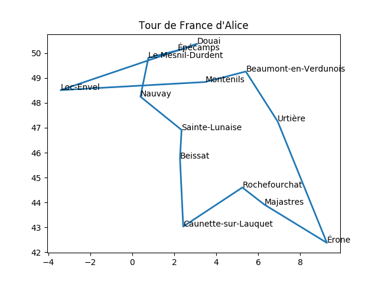
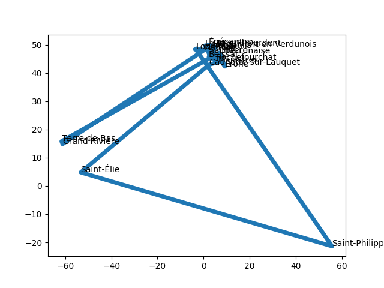
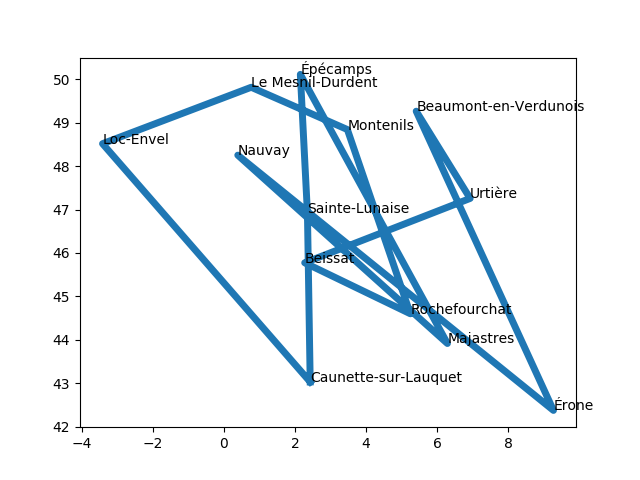
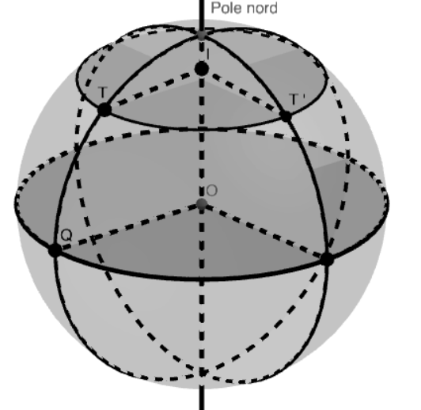
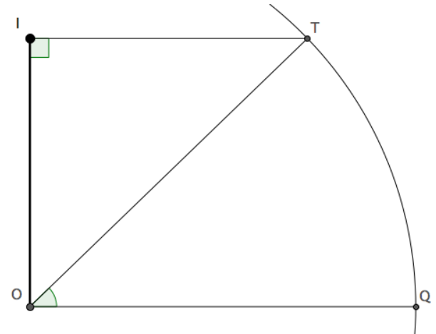
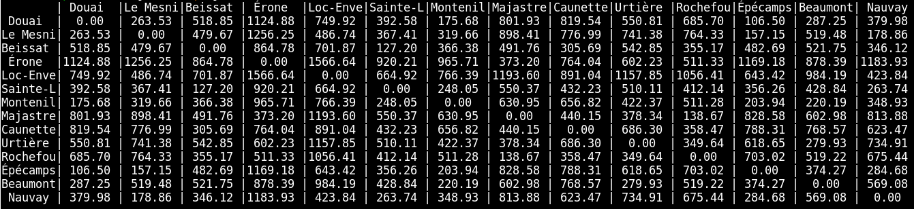

<!--
Compilé avec :
pandoc --latex-engine=xelatex  --template my.latex --highlight-style tango -N readme.md -o wator.pdf
https://download.tuxfamily.org/linuxvillage/Informatique/Cours-Shell-prog/cours_shell_unix.pdf
--->
__

# Tour de France d'Alice

*Alice*, durant l'été, a le projet de visiter en partant de `Douai` les 
villes les moins peuplées de chaque région de France métropolitaine.

Nous allons aider *Alice* à trouver un meilleur chemin possible.

# De quoi ai-je besoin ?

Pour mener à bien cette tâche il nous faut :
 
- Un fichier de recensement de la population contenant au moins :
    - Le nombre d'habitants
    - Le nom de la commune
    - Le nom ou numéro de région
- Un moyen de calculer les distances entre deux villes
- Un algorithme pour minimiser la longueur du parcours

# Fichier de recensement

Allez sur le site de L’Institut national de la statistique et des 
études économiques

1. Télécharger le fichier de recensement (format modifiable)
1. L'ouvrir
1. Extraire les données utiles
1. Enregistrer ces données au format `CSV` dans un fichier `population.csv`
(utiliser le *;* comme délimiteur de champ et aucun caractère pour le 
séparateur de chaîne de caractères).
1. Ouvrir ce fichier dans un éditeur de texte pour vérifier

# Représentation des données

Nous utiliserons un programme `python` pour aider *Alice*. Les données
 utiles sont contenues dans le fichier créer `population.csv`.
 
 Python est capable de lire ce fichier, d'extraire les données ligne
 par ligne
 
 1. Quels sont les noms des champs qui nous seront utiles ?
 
 Il nous faut réfléchir à la représentation des données. Vais-je utiliser
  une chaîne de caractère, un tuple, une liste, un dictionnaire...?
  
Comme vous le savez sans doute il existe en France plusieurs villes ayant 
le même nom. On ne peut donc pas utiliser une structure de données par ville.

Ici Alice souhaite visiter une ville par *région*. On utilisera donc
plutôt un dictionnaire ayant pour clé le nom des régions.

Les valeurs de ces clés seront une liste contenant des tuples 
`(NOM_DE_LA_VILLE, NOMBRE_HABITANTS)`

# Création du dictionnaire régions

~~~python
def creation_dico_region(nom_fichier, encode='utf-8', sep=';'):
    """
    Création d'un dictionnaire :
    clé = nom de région
    valeur = liste des couples ('NOM_DE_VILLE', NOMBRE_HABITANTS)
    """
    dico = {}
    with open(nom_fichier, 'r', encoding=encode) as entree:
        for ligne in entree:
            ligne = ligne.???()
            ligne = ligne.split(sep)
            region = ligne[??]
            ville = ligne[??]
            habitant = int(ligne[??])
            if region not in dico:
                dico[region] = ??
            couple = ??
            dico[region]??????
    return dico
~~~

Si tout va bien vous devriez obtenir: 

~~~python
In [1]: population = creation_dico_region('communes.csv')

In [2]: population['Hauts-de-France'][976]
Out[2]: ('Douai', 40860)
~~~

# Recherche de la ville la moins peuplée

D’après les critères d'Alice il suffit de trouver, pour chaque région, 
la ville ayant le moins d'habitants. Comme toute comparaison il sera
peut-être nécessaire de gérer le cas de l'égalité.

Il nous faut donc une fonction `ville_habitant_min` qui a partir de la 
liste des couples `(NOM_DE_LA_VILLE, NOMBRE_HABITANTS)`, retourne la 
ville ayant le moins d'habitants. 
 
1. Créer cette fonction

~~~python
In [1]: population = creation_dico_region('communes.csv')

In [2]: ville_habitant_min(population['Hauts-de-France'])
Out[2]: ('Épécamps', 5)
~~~

1. Faire de même pour toutes les régions

~~~python
[['Auvergne-Rhône-Alpes', 'Rochefourchat', 1],
 ["Provence-Alpes-Côte d'Azur", 'Majastres', 4],
 ['Corse', 'Érone', 11],
 ['Occitanie', 'Caunette-sur-Lauquet', 4],
 ['Bretagne', 'Loc-Envel', 73],
 ['La Réunion', 'Saint-Philippe', 5288],
 ['Nouvelle-Aquitaine', 'Beissat', 25],
 ['Martinique', "Grand'Rivière", 712],
 ['Grand Est', 'Beaumont-en-Verdunois', 0],
 ['Normandie', 'Le Mesnil-Durdent', 21],
 ['Île-de-France', 'Montenils', 27],
 ['Guadeloupe', 'Terre-de-Bas', 1074],
 ['Hauts-de-France', 'Épécamps', 5],
 ['Centre-Val de Loire', 'Sainte-Lunaise', 17],
 ['Guyane', 'Saint-Élie', 148],
 ['Pays de la Loire', 'Nauvay', 13],
 ['Bourgogne-Franche-Comté', 'Urtière', 8]]
~~~

> Un dictionnaire est une sructure non ordonnée. Il est donc possible 
que votre affichage diffère dans l'ordre des villes. En revanche le 
nombre d'habitants pour une ville est fixé par le fichier `csv`.

# Coordonnée géographique d'une ville

Maintenant que nous disposons de la liste des villes, il nous
faudrait obtenir la distance entre deux villes.

Le site `openstreetmap.org` propose une API pour retourner
les coordonnées (longitude, latitude) d'une ville.
la documentation est disponible ici : 
<https://nominatim.org/release-docs/develop/api/Overview/>

Exemple :

~~~bash
$ curl "https://nominatim.openstreetmap.org/search?city=douai&format=json&limit=1"
[{"place_id":197688064,"licence":"Data © OpenStreetMap contributors, ODbL 1.0. 
https://osm.org/copyright","osm_type":"relation","osm_id":56243,"boundingbox":
["50.3491934","50.4105745","3.0514828","3.149484"],"lat":"50.3703683",
"lon":"3.0761377","display_name":"Douai, Nord, Hauts-de-France, France 
métropolitaine, 59500, France","class":"boundary","type":"administrative",
"importance":0.697524486714456,"icon":"https://nominatim.openstreetmap.org/
images/mapicons/poi_boundary_administrative.p.20.png"}]
~~~

> `curl` est une interface en ligne de commande, destinée à récupérer 
le contenu d'une ressource accessible par un réseau informatique.

Nous réaliserons cette requête à l'aide du module `urllib`. Pour réaliser
 cette requête il faut : 

- importer le module

~~~python
import urllib
~~~

- Créer l'url

~~~python
url = 'https://nominatim.openstreetmap.org/search?city={}&format=json&limit=1'.format(ville)
~~~

- Faire la requête

~~~python
rep = urllib.request.urlopen(url).read()
~~~

- La réponse est de type `bytes`, il faut la décoder en `utf-8`

~~~python
rep = rep.decode('utf-8')
~~~

- Convertir le format `json` en une liste contenant des dictionnaires

~~~python
rep = json.loads(rep)
~~~

- Retourner le `tuple` (lon, lat)

~~~python
return ???
~~~

Vous devriez obtenir pour `douai` le couple `('3.0761377', '50.3703683')`

> Je vous recommande de réaliser une fonction pour faire ce traitement. 
Cette fonction risque de générer une erreur pour certaine entrée. 
Utiliser `urllib.request.quote` pour y remédier.

# Récréation graphique

Maintenant que nous avons les coordonnées des villes, 
on peut les représenter sur un graphique. Les longitudes
correspondent aux abscisses et les latitudes aux ordonnées

Nous allons donc créer la fonction `parcours_trace` ayant pour argument une liste 
contenant un `3-tuple` :
`(Nom_De_Ville, lon, lat)`

Exemple de résultat :

~~~python
[('Beissat', 2.276555, 45.7731784),
 ('Le Mesnil-Durdent', 0.7717656, 49.816042),
 ('Caunette-sur-Lauquet', 2.43100564038826, 43.02828475),
 ('Rochefourchat', 5.2468373, 44.5983241),
 ('Sainte-Lunaise', 2.35310391699823, 46.91466645),
 ('Épécamps', 2.15366, 50.11245),
 ('Nauvay', 0.3943182, 48.2523705),
 ('Majastres', 6.289253, 43.9137024),
 ('Beaumont-en-Verdunois', 5.41109544790579, 49.2649459),
 ('Urtière', 6.9280199, 47.2556929),
 ('Montenils', 3.4764833, 48.8419508),
 ('Érone', 9.2708776, 42.372542),
 ('Loc-Envel', -3.4082882, 48.5162716)]
~~~

Il faut dans un premier temps, réaliser la fonction `tour_to_liste_lon_lat`
 qui prend en argument la liste du tour, retourne une liste de `3-tuple`
de la forme `(Nom_De_Ville, lon, lat)` et produit la sortie ci-dessus.

~~~python
def tour_to_liste_ville_lon_lat(tour):
    """
    A remplir 
    ....
    
    """
    lst = []
    
    for destination in tour:
        ville = destination[??]
        ???
        

    return lst
~~~

1. Compléter le code précédent

Pour réaliser le graphique nous utiliserons le module `pylab`.

~~~python
def parcours_trace(tour):
    """
    A remplir 
    ....
    
    """
    x = [ t[1] for t in tour ]
    y = [ t[2] for t in tour ] 
    x += [ x [0] ] # on ajoute la dernière ville pour boucler
    y += [ y [0] ] #
    pylab.plot(x, y, linewidth=2)
    for ville, x, y in tour :
        pylab.text(x, y, ville) 
    pylab.title(title)
    pylab.show()
~~~

__

> Je vous laisse le soin de corriger le problème

__

# Calcul de distance entre deux villes

Les Grecs de l’Antiquité attribuaient déjà à la Terre une forme 
sphérique et Ératosthène (276-194 av JC) fut le premier à en calculer 
la circonférence. Dans tout ce qui suit, la Terre est assimilée à une 
sphère de rayon 6371 km.

Afin de se repérer à la surface de la sphère terrestre, on utilise des 
coordonnées géographiques (longitude, latitude).

| Ville | Pays | Longitude | Latitude |
|---|---|---|---|
| Libreville  | Gabon | 9° Est    | 0°       |
| Quito    | Équateur | 79° Ouest | 0°       |
| Toronto  | Canada   | 79° Ouest | 44° Nord |
| Toulouse | France   | 1° Est    | 44° Nord |

On note O le centre de la Terre et T, Q et T’ les villes Toronto, Quito 
et Toulouse. 

On note I le centre du parallèle passant par Toronto et 
Toulouse. 

{width="300px"}
{width="300px"}

1. Quelle est l'expression la longueur de l'arc QT ?
1. En considérant la surface de la France plane, compléter la fonction
suivante :

~~~python
def distance_entre_deux_villes(v1, v2):
    """
    Retourne la distance entre deux villes en considérant la
    surface plane
    
    :param v1: tuple (lon, lat)
    :type v1: tuple
    :param v2: tuple (lon, lat)
    :type v2: tuple
    :return: distance en km
    :rtype: float
    """
    
    RT = 6371
    
    lon = ??
    lat = ??
    return math.sqrt(lon**2 + lat**2)
~~~

# Calcul des distances entre les villes du tour

Réaliser une fonction permettant d'obtenir ceci (sans le nom des villes):

__

1. A la main, et en partant de `Douai`, dans quel ordre allez-vous 
parcourir la tournée des villes ?

# Algorithme `glouton`

Pour mener à bien cette opération, nous allons utiliser un algorithme 
qualifié d'algorithme glouton. Le principe est simple:

- On part de la ville de départ
- On choisit la ville la plus proche, parmi les villes non visitées
- On se déplace sur la ville choisie
- On recommence
- On a fini lorsque toutes les villes ont été choisies

## Ville la plus proche

On se place dans un cas qui n'est ni la situation initiale, ni la 
situation finale. On a alors : 

- `tour`: liste des villes à visiter avec leurs coordonnées (lon, lat)
- `id_depart`: indice de la ville de départ
- `id_ville_visite`: liste des indices des villes déjà visitées
- `MAT`: variable globale contenant la matrice des distances
- Retourne l'indice de la ville la plus proche appartenant à la liste 
tour, mais pas à la liste `id_ville_visite`.

Entête de la fonction:

~~~python
def ville_la_plus_proche(tour, id_depart, id_ville_visite):
    """
    Parmi les villes du tour non visitées, retourne l'indice de la 
    ville la plus proche de la ville depart ayant pour indice id_depart.
    
    :param tour: liste de 3-tuple : ('Ville', lon, lat)
    :type tour: list
    :param id_depart: index de la ville de depart
    :type id_depart: int
    :param id_ville_depart: Liste des indices des villes visitées
    :type id_ville_depart: Liste de int
    :return: indice de la ville la plus proche
    :rtype: int
    """
    votre code
~~~

1. Créer cette fonction et vérifier

## Villes les plus proches

En utilisant la fonction `ville_la_plus_proche` nous allons créer la fonction
`parcours_min` qui :

- prend en argument la liste des villes de la tournée
- retourne une liste ordonnée des indices des villes

~~~python
def ville_la_plus_proche(tour):
    VOTTRE CODE
~~~

# Programme principal

~~~python
# Lecture du fichier et création du dictionnaire
population = creation_dico_region('communes.csv')

# Recherche les villes les moins peuplées
tour = tour_depeuple(population)

# Recherche les longitudes et les latitudes
villes = tour_to_liste_ville_lon_lat(tour)

# Calcul des distances inter-villes
MAT = matrice_distance(villes)

# Recherche le parcours le moins long
p_min=parcours_min(villes)

# Trace le parcours
parcours_trace(p_min)
~~~

__
