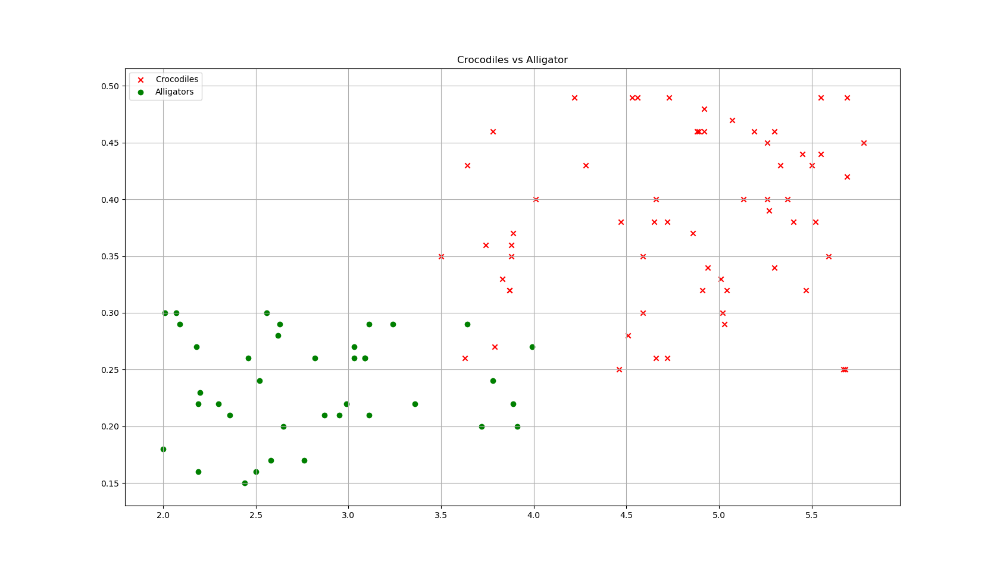
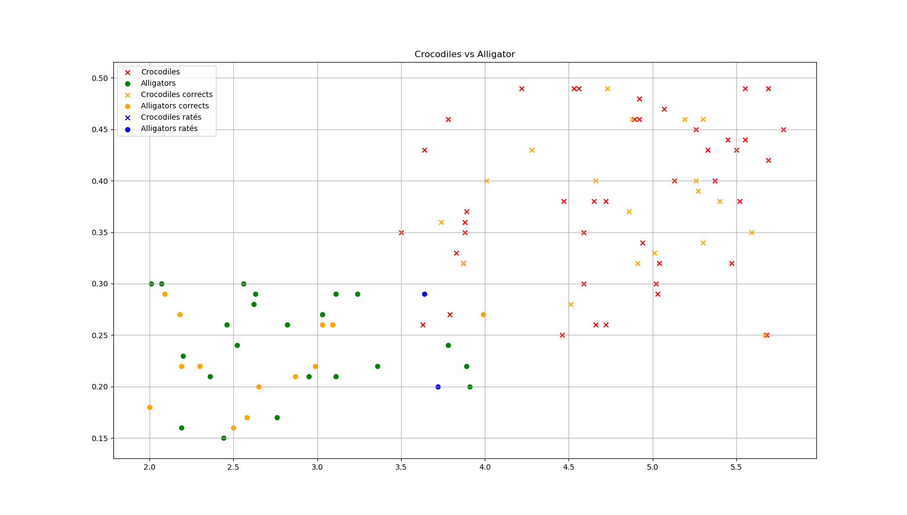

# Illustration des k plus proches voisins : Crocodiles vs Alligators ?

Cet exemple complet vous présente l'implémentation des k plus proches voisins
pour classifier des animaux.

On utilise seulement deux critères très simples :

* le longueur de l'animal
* la taille de sa gueule

L'exemple est volontairement limité à deux caractéristiques afin de pouvoir
les présenter graphiquement dans un _plan_. Au delà de deux caractéristiques,
il faut utiliser plusieurs graphiques et c'est nettement moins lisible.

Sur une figure, c'est simple, on voit nettement la démarcation.

Avec les données chiffrées aussi.

Nous devrions donc parvenir à distinguer facilement et repérer nos erreurs.

## Données

Toutes les données utilisées ici sont fictives. Je vous joint d'ailleurs
le programme qui me sert à les générer.

Il illustre le cours "donnée en table : création d'une table".

### Examen des données

**[crocos.csv](crocos.csv)**

~~~
taille,gueule,espece
3.78,0.46,crocodile
2.18,0.27,alligator
5.04,0.32,crocodile
2.2,0.23,alligator
3.24,0.29,alligator
5.55,0.49,crocodile
5.4,0.38,crocodile
3.03,0.27,alligator
...
~~~

Ce fichier (généré aléatoirement par [generer_donnees.py](generer_donnees.py))
contient une table csv de données concernant les reptiles.

Les champs sont donc `taille`, `gueule` et `espece`

Une fois dessiné, on obtient ce graphique :

Ainsi qu'on peut le voir, il y a un léger chevauchement des données.

## Utiliser le programme

Dans l'ordre, voici les étapes à exécuter :

1. récupérer tous le fichier [crocos.zip](crocos.zip) et tout extraire dans un même dossier (depuis github, cliquer dessus, download)
2. (optionnel) exécuter le fichier [generer_donnees](generer_donnees.py)

    Il va modifier le contenu du fichier csv.

3. exécuter le fichier [presenter_donnees](presenter_donnees.py)

    Ce fichier va vous dessiner le graphique présentant les données.
    Fermer la fenêtre ou arrêter le script.

4. exécuter le fichier [knn](knn.py)

    Ce script applique l'algorithme des k plus proches voisins avec `k=3`
    au jeu de données précédent.

    Une fois les calculs effectués, il affiche dans la console la précision (entre 0 et 1).

    Espérons qu'elle soit proche de 1 !

    Ensuite il dessine les résultats. Vous devriez obtenir un graphique similaire à :

    

    On y distingue :

    * en rouge et vert les données ayant servi à l’entraînement,
    * en orange, les données testées qui sont correctes (rond alligators, croix crocodiles)
    * en bleu, les données testées qui ont échoué (mauvaises prédictions par kNN)

    Comme on pouvait s'y attendre, les reptiles mal classifiés sont ceux qui
    sont au centre de la figure, là où les zones "rouges" et "vertes" se rencontrent.

    Attention, il y a plusieurs étapes aléatoires (génération des données, séparation
    des jeux de tests et d'entraînement) qui font que vous pouvez parfaitement
    n'avoir aucun reptile mal classifié. Vous ne verriez alors aucun point bleu.

    Recommencez la simulation pour changer vos données.

_Remarque_ : le dernier fichier [presenter_resultats](presenter_resultats.py)
n'a pas grand intérêt. C'est un copier coller sauvage pour créer rapidement
la figure précédente.

## Consignes

1. Lire soigneusement tout le code (sauf [presenter_resultats](presenter_resultats.py))

   Remarquez que j'utilise surtout les outils de base et qu'on passe en revue
   presque toute la partie programmation (liste, dictionnaire, fonctions,
   charger un csv, écrire dans un csv etc.)

2. Compléter la documentation des fonction dont la documentation ne contient rien.

    Il y en a quatre.

3. Créer un script python `classifier_nouveaux.py`

    Importer le script `knn.py` et créer une fonction `classifier`

    Elle prend en paramètre un reptile sous la forme :

    ~~~python
    reptile = {
      "largeur": 5.2,
      "gueule": 0.7
    }
    ~~~

    Les données numériques sont libres mais doivent rester aux alentours
    des celles du jeu initial.

    Votre fonction renvoie la classe du reptile en question.

4. Améliorer votre fonction pour qu'elle ajoute une clé `"espece"`

    dont la valeur est le vote obtenu.

5. Copier ce qui est fait dans [charger_donnees.py](charger_donnees.py)
    générer des reptiles dont on connait les dimensions mais pas l'espèce.

    Englober ce travail dans une fonction `creer_nouveaux(nombre)`

    dont le paramètre `nombre` est... le nombre de reptiles à créer.

    Retourner une liste de nouveaux reptiles.

6. Présenter vos données.

    On doit voir, la figure avec les reptiles du jeu de données
    et les nouveaux en bleu.

    Inspirez-vous de ce qui est fait dans [presenter_donnees.py](presenter_donnees.py)

    
