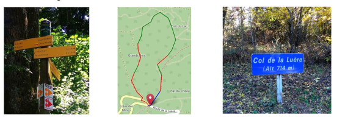
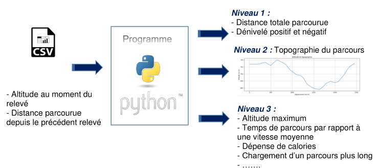
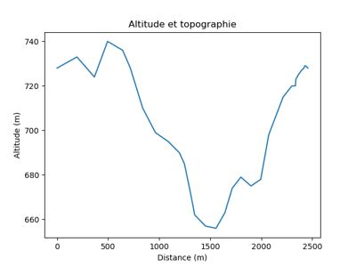

# TP randonnée

## Présentation de l'activité

## Niveau 1 : Lecture des données et utilisation de ces données

### 1. Ouvrir le fichier **rando.csv** avec Sublime Text (ou Atom, Visual Studio Code etc.).

### 2. Ouvrir également ce fichier avec LibreOffice Calc (ou Excel, Google Sheet).

  Libre office ouvre une fenêtre avec une prévisualisation du fichier en bas.

  Compléter sur ce document et changer, si nécessaire, sur le logiciel les
  éléments suivants :

  * Jeu de caractères :
  * Séparé par : $\square$ Tabulation, $\square$ Virgule,
  $\square$ Points virgules, $\square$ Espace, $\square$ Autre
  * Que fait le tableur et à quoi ressemble désormais ce fichier ?\

### 3. Travail sur Python

Ouvrir un nouveau fichier dans **Thonny** (ou un autre éditeur de code) et
l'enregistrer au même endroit que votre fichier csv sous le nom **rando_python.py**

### 4. **À partir des fonctionnes données dans les TP précédents et dans le cours.**

Si le résultat correspond à la réponse attendue, cocher la case
correspondante

1. **Programme 1 :** Ouvrir le fichier csv et copier :

    * la première ligne dans une liste, nommée `liste_entetes`
    * le reste du fichier dans une liste, nommée `parcours`, de listes à deux
      éléments comprenant `[altitude, distance parcourue]`

      **$\square$ résultat du test attendu :**

      ~~~python
      liste_entetes :  ['Altitude (m)', 'Distance (m)']

      parcours :  [['728', '0'], ['728', '194.67'], ['733', '171.32'],
      ['724', '128.82'], ['740', '148.06'], ['736', '74.97'], ['728', '121.41'],
      ['710', '124.03'], ['699', '125.37'], ['695', '108.81'], ['690', '49.72'],
      ['685', '32.13'], ['678', '31.42'], ['671', '37.33'], ['662', '105.44'],
      ['657', '103.43'], ['656', '86.72'], ['663', '72.01'], ['674', '85.05'],
      ['679', '98.53'], ['675', '95.58'], ['678', '78.16'], ['698', '141.14'],
      ['715', '85.69'], ['720', '34.86'], ['720', '4.23'], ['723', '24.19'],
      ['725', '31.3'], ['727', '23.1'], ['728', '7.77'], ['729', '10.13'],
      ['729', '20.9'], ['728', '1.91']]
      ~~~

2. **Programme 2 :** Réaliser une **fonction** qui permet de séparer
  cette liste en deux listes de **nombres** dont une, nommée `altitudes`,
  contient les altitudes, et l'autre, nommée `distances`, les distances
  parcourue.

    **$\square$ résultat du test attendu :**

    ~~~python
    altitudes :  [728.0, 728.0, 733.0, 724.0, 740.0, 736.0, 728.0,
    710.0, 699.0, 695.0, 690.0, 685.0, 678.0, 671.0, 662.0, 657.0,
    656.0, 663.0, 674.0, 679.0, 675.0, 678.0, 698.0, 715.0, 720.0,
    720.0, 723.0, 725.0, 727.0, 728.0, 729.0, 729.0, 728.0]

    distances :  [0.0, 194.67, 171.32, 128.82, 148.06, 74.97,
    121.41, 124.03, 125.37, 108.81, 49.72, 32.13, 31.42, 37.33,
    105.44, 103.43, 86.72, 72.01, 85.05, 98.53, 95.58, 78.16,
    141.14, 85.69, 34.86, 4.23, 24.19, 31.3, 23.1, 7.77, 10.13,
    20.9, 1.91]
    ~~~

3. **Programme 3 :** Réaliser une fonction (nommée `denivele`) qui calcule
  le dénivelé cumulé positif et négatif. Votre fonction prend en paramètre
  d'entrée la liste des altitudes et renvoie un tuple de deux nombres.

    **$\square$ résultat du test attendu :**

    ~~~python
    le dénivelé cumulé positif du parcours est de 98.0 m
    le dénivelé cumulé négatif du parcours est de 98.0 m
    ~~~

4. **Programme 4 :** Réaliser une fonction (nommée `cumul_distance`) qui va
  générer une nouvelle liste Python (nommée `distances_parcourues`) et donner
  la longueur cumulée à chaque étape.

    **$\square$ résultat du test attendu :**

    ~~~python
    liste distance_parcourues : [0, 0.0, 194.67, 365.99, 494.81, 642.87, 717.84,
    839.25, 963.28, 1088.65, 1197.46, 1247.18, 1279.31, 1310.73, 1348.06,
    1453.5, 1556.93, 1643.65, 1715.66, 1800.71, 1899.24, 1994.82, 2072.98,
    2214.12, 2299.81, 2334.67, 2338.9, 2363.09, 2394.39, 2417.49, 2425.26,
    2435.39, 2456.29]
    La longueur totale du parcours est de 2456.29 m
    ~~~

## Niveau 2 : présenter les données sous forme de graphique

1. **Programme 5 :** réaliser une **fonction** (nommée `visualisation_denivele`)
    qui génère un graphique à partir des listes renvoyées par la fonction du
    programme 2.

    Le nom des axes x et y seront récupérés à l'aide de la liste
    (nommée `liste_entetes`) crée dans le programme 1.

    On utilisera le module `pylab` et sa fonction plot.\
    Aide : [https://courspython.com/introduction-courbes.html](https://courspython.com/introduction-courbes.html)

    **$\square$ résultat du test attendu :**

    

2. **Programme 6 :** Pour mieux se repérer avec son GPS, il est plus intéressant
    d'avoir la distance parcourue que la distance entre deux points. On va
    générer un nouveau fichier CSV avec cette nouvelle information.

    Écrire dans un nouveau fichier CSV (nommé **fichier_rando.csv**) la distance
    parcourue dans la première colonne et l'altitude dans la seconde colonne.
    Ne pas oublier de compléter les entêtes dans la première ligne.

    **$\square$ résultat du test attendu :**

    ~~~python
    Distance (m);Altitude (m)
    0.00;728.00
    0.00;728.00
    194.67;733.00
    365.99;724.00
    494.81;740.00
    ~~~

## Niveau 3 : autres exploitations possibles

On peut imaginer

* de chercher l'altitude la plus haute, la plus basse,
* de tester le programme avec un fichier pour un circuit de plusieurs dizaines
  de kilomètres,
* d'estimer le temps de parcours par rapport à une vitesse moyenne de l'utilisateur
    * sans tenir compte de l'altitude,
    * en tenant compte des dénivelés.
* d'estimer la dépense calorique pour ce parcours

## Rendre le travail

Vous rendrez les fichiers (script python et nouveau fichier csv) via **classroom** exclusivement
